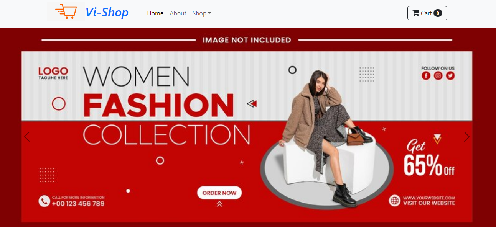

# Shopping-Cart

This is a sample Shopping-Cart which was designed by me using React. It's Guvi-Zen class Roadmap session: Day-23 and React : Day-3 Task.

## Tech Stack

- HTML
- CSS
- Javascript
- Bootstrap
- React(useState)

## Features

- Responsive and attractive Design

## Lessons Learned

I learned to use useState hook as well as update component elements as per the request which helped me to understand how react manipulating browser Dom.

## Website

[Shooping_Cart](https://statuesque-beijinho-49dbc2.netlify.app/)

## Screenshots

(./public/Images/demo1.png)(./public/Images/demo2.png)

## Setup

Followig are the requirements to run this project:
- Node Package Manager (NPM)
- React

## `npm start`

Runs the app in the development mode.\
Open [http://localhost:3000](http://localhost:3000) to view it in your browser.

The page will reload when you make changes.\
You may also see any lint errors in the console.

## Feedback

If you have any feedback, please reach out to me at vijaymayhul@gmail.com

